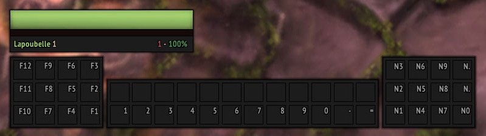
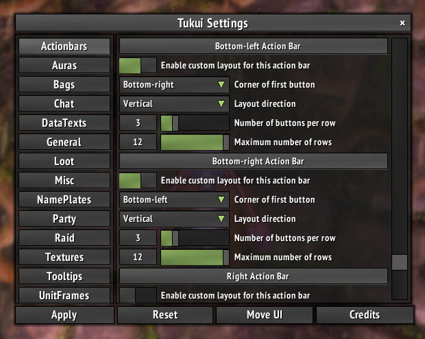

# Tukui Custom Action Bar Layout

This is an addon for World of Warctaft Classic's Tukui that allows defining a custom layout for the action bars.

## Rationale

The reason that I've made this addon is because I use an MMO mouse (Logitech G600), which has 12 thumb buttons. I wanted my bottom-left and bottom-right action bars to be in the same 3x4 button configuration as those thumb buttons to make it easier to memorize which button belongs to which spell.

## What's possible

For each of the 5 action bars you can specify in which corner the first button of the action bar is located, and in which direction (horizontal or vertical) the subsequent buttons are laid out. You can also specify how many buttons are in a single row; additional buttons are laid it in a following row. This allows you to create almost any grid configuration that you can think of.

###### Example

*Example of a 3x4 layout*

###### Configuration

*Configuration options*

## Credits

Many thanks to Tukz and all other members of [Tukui.org](https://www.tukui.org) community who've put so much effort into creating the Tukui addon.
